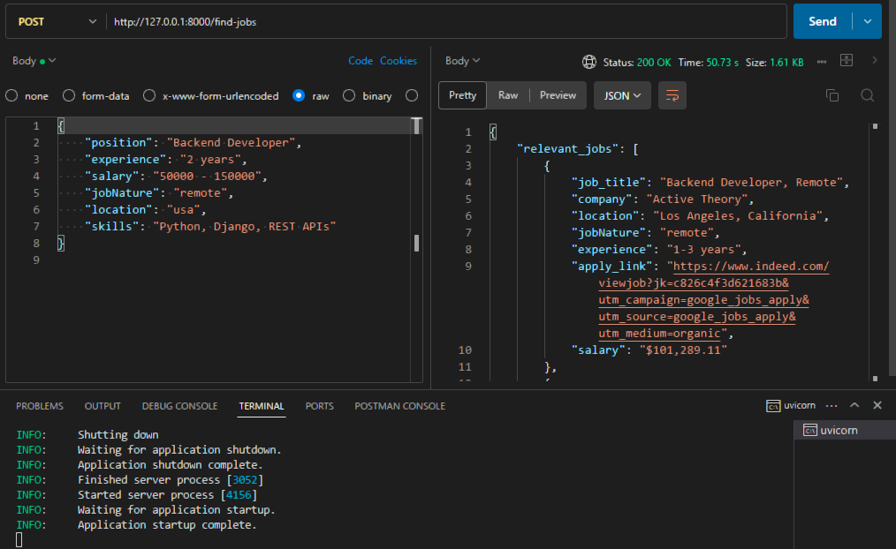
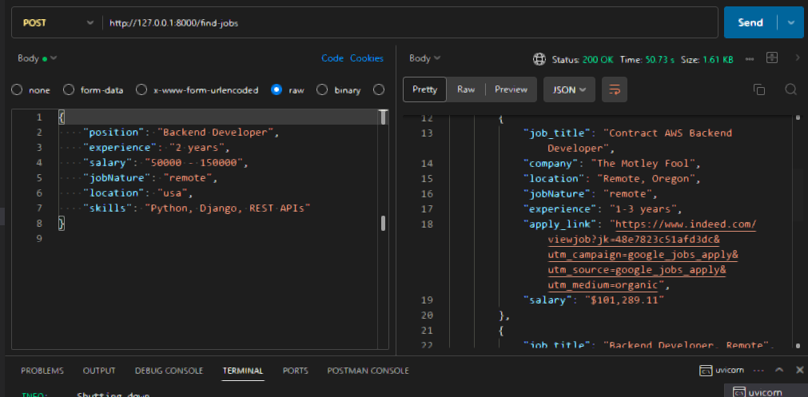
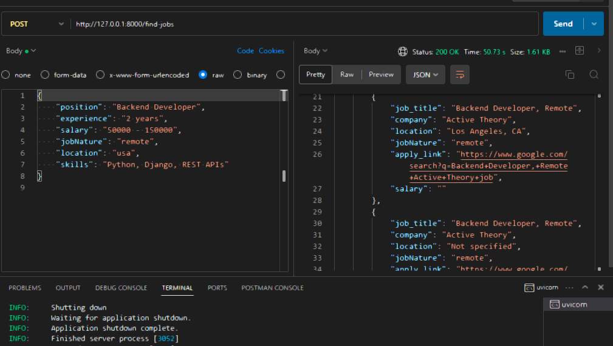
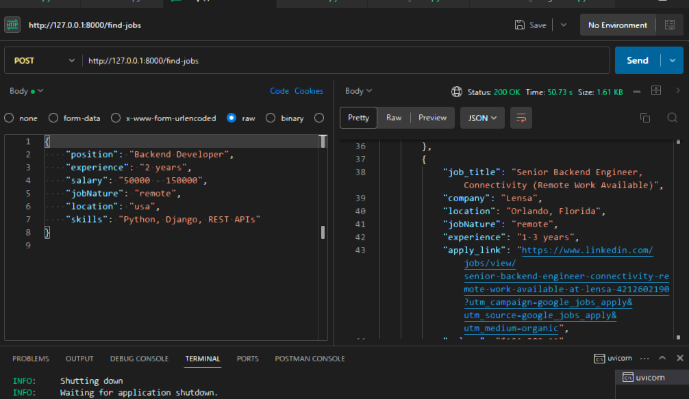
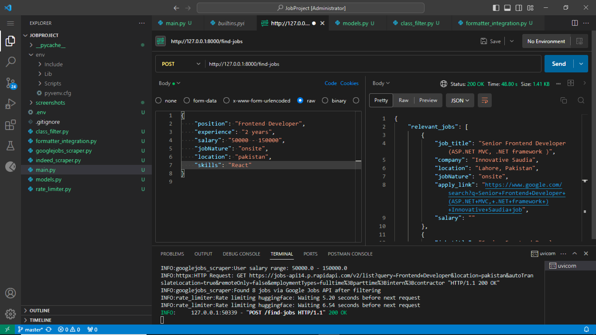
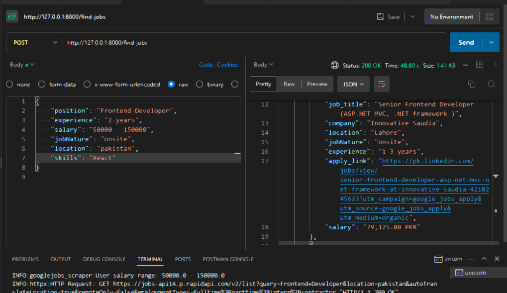
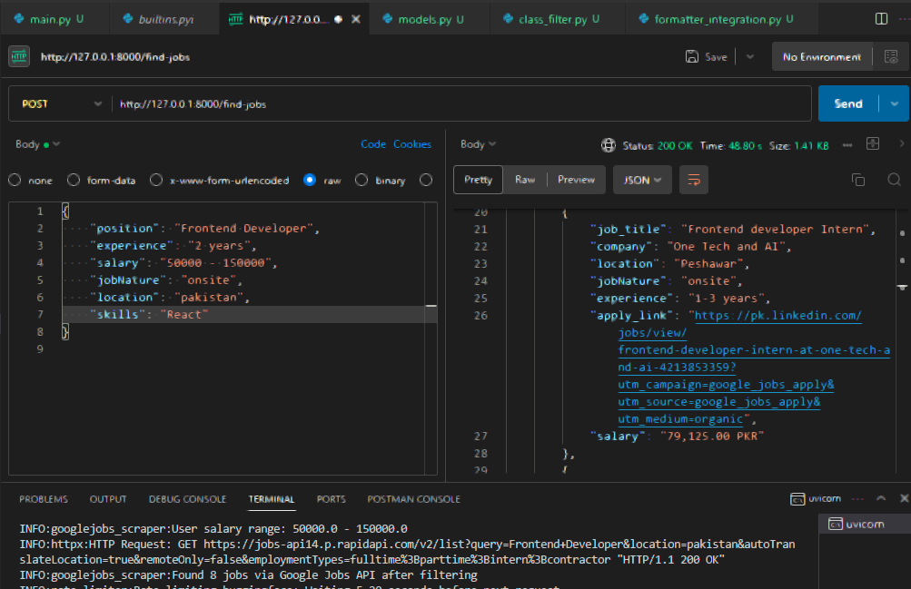
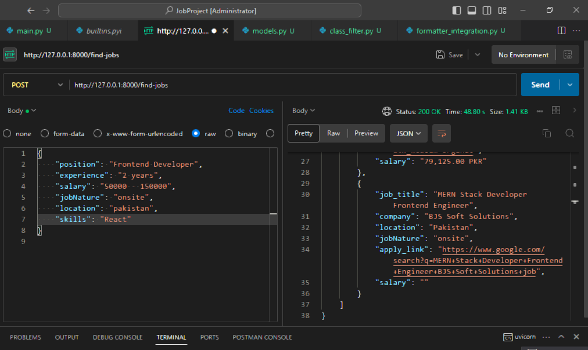

# job-finder-api
A job search API based on FastAPI that scrapes listings from sites such as LinkedIn and Indeed. It sifts through jobs for users according to their criteria with AI-driven relevance scoring and returns suitable recommendations.

# Job Search API Documentation

This documentation provides a comprehensive overview of the Job Search API, detailing its available endpoints, data models, and core functionality.

## Overview

The Job Search API enables users to search for job opportunities across multiple platforms, including LinkedIn, Indeed, and Google Jobs. It processes search results based on user-defined criteria and returns relevant job listings in a standardized format.

## API Endpoints

### `POST /find-jobs`

Searches for jobs across multiple platforms based on the provided search criteria.

#### Request Parameters

| Parameter       | Type            | Description                          | Default | Constraints            |
|-----------------|-----------------|--------------------------------------|---------|------------------------|
| `request`       | JobSearchRequest | Search criteria object               | -       | Required               |
| `limit`         | integer         | Maximum number of results to return | 3       | Min: 1, Max: 5         |

## Implementation Details

### Job Sources

The API fetches job listings from the following primary sources:

- **LinkedIn**: Uses the JSearch API with a fallback to web scraping if the API is unavailable or returns no results.
- **Indeed**: Utilizes the JSearch API.
- **Google Jobs**: Leverages the Jobs API v14.

### Job Processing Pipeline

1. **Search**: Aggregates job listings from all supported platforms.
2. **Description Enrichment**: Fetches detailed job descriptions for enhanced relevancy scoring.
3. **Relevance Scoring**: Scores jobs based on their match to the search criteria.
4. **Skills Matching**: Matches user-provided skills against job descriptions.
5. **Sorting**: Prioritizes results based on relevance score.
6. **Formatting**: Prepares the final output in a standardized format for consistency.

### Rate Limiting

To maintain compliance with third-party API rate limits, the API implements the following strategies:
- **Exponential Backoff**: Retries failed requests with increasing intervals.
- **429 Error Handling**: Manages "Too Many Requests" responses gracefully.
- **Random Jitter**: Adds random delays to avoid request clustering.

### Error Handling

- Returns appropriate HTTP status codes for all scenarios.
- Logs detailed error information for debugging and monitoring.
- Implements fallback mechanisms to ensure continuity when primary data sources fail.

## Configuration

The API requires the following environment variables:

- `JSEARCH_API_KEY`: API key for JSearch (LinkedIn and Indeed).
- `JOBS_API_KEY`: API key for Jobs API (Google Jobs).
- `HUGGINGFACE_API_KEY`: API key for scoring job relevance.
- I got these API keys from rapidapi.

## Running the API

To run the API locally, use the following command:

```bash
uvicorn main:app --host 0.0.0.0 --port 8000 --reload
```

The API will be accessible at: [http://localhost:8000](http://localhost:8000).

## API Documentation

Interactive API documentation is available once the server is running:

- **Swagger UI**: [http://localhost:8000/docs](http://localhost:8000/docs)
- **ReDoc**: [http://localhost:8000/redoc](http://localhost:8000/redoc)

## How the Job Matching System Works

Our job search aggregation and matching system uses a multi-layered approach to identify the most relevant job opportunities across multiple platforms. Below is an overview of how it works:

### 1. Data Collection from Multiple Sources
The system queries multiple job platforms simultaneously to gather a diverse set of opportunities:

- **LinkedIn**: Utilizes LinkedIn's job postings via the JSearch API, with a fallback to direct web scraping if the API does not return results.
- **Indeed**: Retrieves job listings from Indeed using the JSearch API.
- **Google Jobs**: Collects job postings from Google's job aggregation service via the Jobs API v14.

For each platform, we implement both API-based collection and fallback scraping mechanisms to ensure reliability and comprehensive coverage.

### 2. Intelligent Job Description Processing
For high-potential job opportunities, the system:

- Fetches complete job descriptions where available.
- Extracts key details, such as salary ranges, experience requirements, and job type (remote/onsite).
- Standardizes data formats across different platforms.
- Applies rate limiting to comply with API usage policies and prevent IP blocking.

### 3. Advanced Relevance Scoring
At the core of the system is a relevance scoring engine that:

- Leverages the Hugging Face API with the Flan-T5 model to evaluate job-to-user match quality.
- Implements a sophisticated prompt-based scoring system that considers:
  - **Position title relevance**.
  - **Location matching**.
  - **Salary range compatibility**.
  - **Experience level alignment**.
  - **Job type preference** (remote vs. onsite).
  - **Skills matching** between user profiles and job requirements.

### 4. Skills-Based Matching
The system performs detailed skills analysis by:

- Extracting skills from job descriptions using natural language processing (NLP).
- Matching these skills against user-provided profiles.
- Applying a weighted scoring boost based on the percentage of matched skills.
- Assigning additional weight to skills mentioned in the job title.

### 5. Prefiltering and Optimization
To optimize processing time and maintain quality, the system:

- Prefilters jobs based on key parameters such as position title and location.
- Conducts comprehensive analysis for a limited number of high-potential jobs.
- Simplifies scoring for the remaining jobs, focusing primarily on skills matching.
- Caches results to improve performance for similar searches.

### 6. Results Ranking and Presentation
Finally, the system:

- Sorts jobs by relevance score in descending order.
- Formats the results with standardized fields for clean presentation.
- Returns a curated set of the most relevant opportunities to the user.

## 📸 API Testing Examples

Example1:






Example2:






# Sample request/response

Requests:
```json
{
    "position": "Frontend Developer",
    "experience": "2 years",
    "salary": "50000 - 150000",
    "jobNature": "onsite",
    "location": "pakistan",
    "skills": "React"
}
```

Response:
```json
{
    "relevant_jobs": [
        {
            "job_title": "Sr. FrontEnd Developer (Angular/Threejs)",
            "company": "Pakistan Recruitment",
            "location": "Lahore, Pakistan",
            "jobNature": "onsite",
            "experience": "",
            "apply_link": "https://www.google.com/search?q=Sr.+FrontEnd+Developer+(Angular/Threejs)+Pakistan+Recruitment+job",
            "salary": ""
        },
        {
            "job_title": "Frontend developer Intern",
            "company": "One Tech and AI",
            "location": "Peshawar",
            "jobNature": "onsite",
            "experience": "1-3 years",
            "apply_link": "https://pk.linkedin.com/jobs/view/frontend-developer-intern-at-one-tech-and-ai-4213853359?utm_campaign=google_jobs_apply&utm_source=google_jobs_apply&utm_medium=organic",
            "salary": "79,125.00 PKR"
        },
        {
            "job_title": "Junior Front End Developer",
            "company": "Translation Empire PK",
            "location": "Rawalpindi, Pakistan",
            "jobNature": "onsite",
            "experience": "",
            "apply_link": "https://www.google.com/search?q=Junior+Front+End+Developer+Translation+Empire+PK+job",
            "salary": ""
        },
        {
            "job_title": "Front-End / Full-Stack Developer",
            "company": "Securiti.ai",
            "location": "Karachi, Pakistan",
            "jobNature": "onsite",
            "experience": "",
            "apply_link": "https://www.google.com/search?q=Front-End+/+Full-Stack+Developer+Securiti.ai+job",
            "salary": ""
        },
        {
            "job_title": "MERN Stack Developer Frontend Engineer",
            "company": "BJS Soft Solutions",
            "location": "Pakistan",
            "jobNature": "onsite",
            "experience": "",
            "apply_link": "https://www.google.com/search?q=MERN+Stack+Developer+Frontend+Engineer+BJS+Soft+Solutions+job",
            "salary": ""
        },
        {
            "job_title": "Front-end Developer in Karachi |  Webnet Pakistan",
            "company": "Webnet Pakistan Pvt Ltd",
            "location": "Karachi, Pakistan",
            "jobNature": "onsite",
            "experience": "",
            "apply_link": "https://www.google.com/search?q=Front-end+Developer+in+Karachi+|++Webnet+Pakistan+Webnet+Pakistan+Pvt+Ltd+job",
            "salary": ""
        },
        {
            "job_title": "Front-end UI Developer",
            "company": "Life @ Get Licensed",
            "location": "PK",
            "jobNature": "onsite",
            "experience": "1-3 years",
            "apply_link": "https://pk.linkedin.com/jobs/view/front-end-ui-developer-at-life-%40-get-licensed-4190594057?utm_campaign=google_jobs_apply&utm_source=google_jobs_apply&utm_medium=organic",
            "salary": "79,125.00 PKR"
        },
        {
            "job_title": "Junior Front End Developer",
            "company": "Translation Empire PK",
            "location": "Rawalpindi",
            "jobNature": "onsite",
            "experience": "1-3 years",
            "apply_link": "https://pk.linkedin.com/jobs/view/junior-front-end-developer-at-translation-empire-pk-4166896822?utm_campaign=google_jobs_apply&utm_source=google_jobs_apply&utm_medium=organic",
            "salary": "79,125.00 PKR"
        }
    ]
}
```

Request:
```json
{
    "position": "Backend Developer",
    "experience": "2 years",
    "salary": "50000 - 150000",
    "jobNature": "remote",
    "location": "usa",
    "skills": "Python, Django, REST APIs"
}
```

Response:
```json
{
    "relevant_jobs": [
        {
            "job_title": "Backend Developer, Remote",
            "company": "Active Theory",
            "location": "Los Angeles, California",
            "jobNature": "remote",
            "experience": "1-3 years",
            "apply_link": "https://www.indeed.com/viewjob?jk=c826c4f3d621683b&utm_campaign=google_jobs_apply&utm_source=google_jobs_apply&utm_medium=organic",
            "salary": "$101,289.11"
        },
        {
            "job_title": "Contract AWS Backend Developer",
            "company": "The Motley Fool",
            "location": "Remote, Oregon",
            "jobNature": "remote",
            "experience": "1-3 years",
            "apply_link": "https://www.indeed.com/viewjob?jk=48e7823c51afd3dc&utm_campaign=google_jobs_apply&utm_source=google_jobs_apply&utm_medium=organic",
            "salary": "$101,289.11"
        },
        {
            "job_title": "Backend Developer, Remote",
            "company": "Active Theory",
            "location": "Los Angeles, CA",
            "jobNature": "remote",
            "experience": "",
            "apply_link": "https://www.google.com/search?q=Backend+Developer,+Remote+Active+Theory+job",
            "salary": ""
        },
        {
            "job_title": "Backend Developer, Remote",
            "company": "Active Theory",
            "location": "Not specified",
            "jobNature": "remote",
            "experience": "",
            "apply_link": "https://www.google.com/search?q=Backend+Developer,+Remote+Active+Theory+job",
            "salary": "80,811–121,217 a year"
        },
        {
            "job_title": "Senior .NET Backend Developer – iGaming / Sportsbook (Fully Remote)",
            "company": "Playnetic",
            "location": "Malta, OH",
            "jobNature": "remote",
            "experience": "",
            "apply_link": "https://www.google.com/search?q=Senior+.NET+Backend+Developer+–+iGaming+/+Sportsbook+(Fully+Remote)+Playnetic+job",
            "salary": ""
        },
        {
            "job_title": "Backend Developer (Remote Option)",
            "company": "Trinnex",
            "location": "Not specified",
            "jobNature": "remote",
            "experience": "",
            "apply_link": "https://www.google.com/search?q=Backend+Developer+(Remote+Option)+Trinnex+job",
            "salary": "80,811–121,217 a year"
        },
        {
            "job_title": "Remote Back-End Developer Intern (Node.js)",
            "company": "BottleUp",
            "location": "Washington, DC",
            "jobNature": "remote",
            "experience": "",
            "apply_link": "https://www.google.com/search?q=Remote+Back-End+Developer+Intern+(Node.js)+BottleUp+job",
            "salary": ""
        },
        {
            "job_title": "Senior Backend Engineer, Connectivity (Remote Work Available)",
            "company": "Lensa",
            "location": "Orlando, Florida",
            "jobNature": "remote",
            "experience": "1-3 years",
            "apply_link": "https://www.linkedin.com/jobs/view/senior-backend-engineer-connectivity-remote-work-available-at-lensa-4212602190?utm_campaign=google_jobs_apply&utm_source=google_jobs_apply&utm_medium=organic",
            "salary": "$101,289.11"
        }
    ]
}
```


